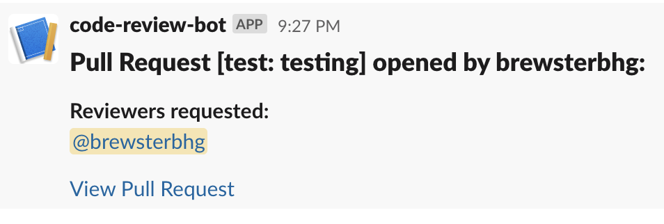

<h1 align="center">
  Code Review Bot 🤖
</h1>

## Introduction 👋

This repository contains the code for setting up a cloud function for formatting/sending Slack notifications.

The purpose of this function is to take information from a pull request and create Slack notifications for tagging relevant users for code reviews. This project is configured to use Google Cloud Functions, but could be configured to use the cloud provider of your choice.

---

## Get Running 🏃

Compile TypeScript code to dist folder:

```
yarn compile
```

Start function locally:

```
yarn start
```

This will run the `postToSlack` function at `http://localhost:8080/`

---

## Usage ⚙️

The `postToSlack` entrypoint function accepts a request object with the following properties:

| Param      | Type   | Description                                                     |
| ---------- | ------ | --------------------------------------------------------------- |
| labels     | string | a comma-delimited string of labels attached to the pull request |
| requestUrl | string | the url of the pull request                                     |
| title      | string | the title of the pull request                                   |
| user       | string | the user who opened the pull request                            |

<br>
Example of a formatted Slack notification:


---

## Contributing 🤝

If you've noticed a bug or have a feature you'd like to suggest, please open a [GitHub Issue](https://github.com/Phizzard/Porunga/issues). If you would like to contribute to the project, feel free to fork this repo, create a new branch & open a pull request.

### Conventional Commits

This project follows [Conventional Commit](https://www.conventionalcommits.org/en/v1.0.0-beta.4/) specifications. The Husky `commit-msg` hook checks that commit messages adhere to these standards using [commitlint](https://github.com/conventional-changelog/commitlint).

### Commitizen

This project uses [Commitizen](https://github.com/commitizen/cz-cli) to generate commit messages that adhere to Conventional Commit specifications. To use Commitizen, run `yarn cz`. This will walk you through generating a commit messsage by prompting you to enter following:

- Commit type (`feat`, `fix`, `docs`, `style`, `refactor`, `perf`, `test`, `build`, `ci`, `chore`, `revert`)
- Scope (optional)
- Short description
- Long description (optional)
- Whether it produces any breaking changes
- Whether it closes any open issues
